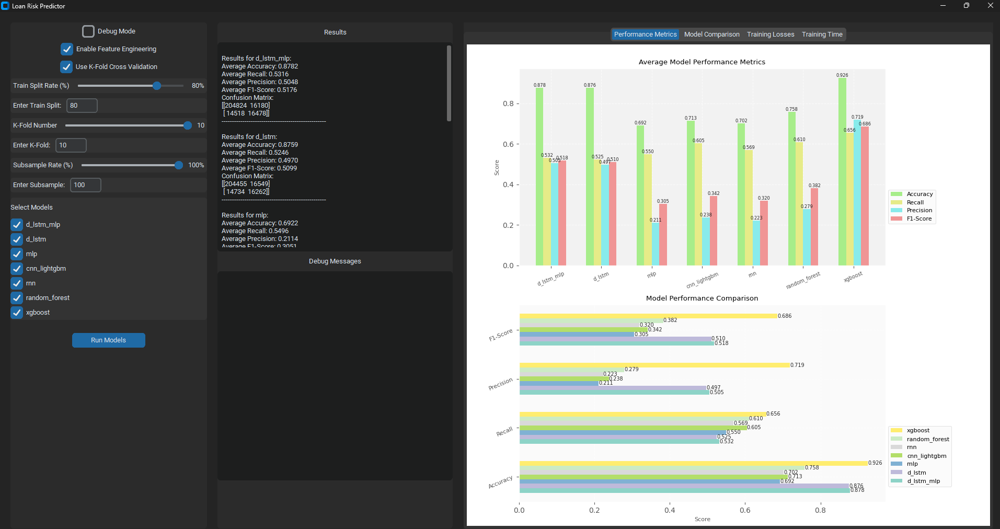

# Loan Risk Predictor

A machine learning system for predicting loan risk using multiple models, including D-LSTM-MLP, D-LSTM, MLP, CNN-LightGBM, DNN, Random Forest, XGBoost and RNN.

## Features

- Multiple machine learning and deep learning models for loan risk prediction
- Feature engineering and autoencoder-based feature extraction
- K-fold cross-validation support
- Training loss comparison across all deep learning models
- Individual model training loss tracking
- Training time comparison across all models
- Comprehensive model performance metrics
- Real-time GUI visualization
- Configurable model parameters and training settings

## Prerequisites

- Python 3.12 or higher
- Poetry (Python package manager)

## Installation

1. Clone the repository:
```bash
git clone https://github.com/JiaLong0209/loan-risk-predictor.git
cd loan-risk-predictor
```

2. Install dependencies using Poetry:
```bash
poetry install
```

3. Activate the virtual environment:
```bash
poetry shell
```

## Usage

### GUI Application

To run the GUI application:

```bash
python -m src.main
```

The GUI provides the following controls:
- Train Split Rate: Adjust the training/test split ratio (50-90%)
- K-Fold Number: Set the number of folds for cross-validation (2-10)
- Subsample Rate: Control the data subsampling rate (0.1-100%)
- Model Selection: Choose which models to run
- Run Models: Start the training and evaluation process

### Command Line Interface

To run specific models from the command line:

```bash
python -m src.main --model d_lstm  # Run only D-LSTM model
python -m src.main  # Run all models
poetry run python -m src.main --gui # Run GUI
```

## Project Structure

```
src/
├── config/
│   └── config.py
├── data/
│   └── data_repository.py
├── models/
│   ├── base_model.py
│   ├── model_factory.py
│   ├── d_lstm_mlp_model.py    
│   ├── d_lstm_model.py
│   ├── mlp_model.py
│   ├── cnn_lightgbm_model.py
│   ├── dnn_model.py
│   ├── random_forest_model.py
│   └── rnn_model.py
├── utils/
│   ├── test_utils.py
│   ├── feature_engineering.py
│   └── logger.py
├── app.py
├── gui.py
└── main.py
```

## Configuration

The system uses a YAML-based configuration system (`config.yaml`) to manage various aspects of the application:

### Model Configuration
- Model selection and default model settings
- Hyperparameters for each model type
- Training parameters (batch size, epochs, learning rate)
- Model-specific configurations (e.g., LSTM layers, MLP architecture)

### Feature Engineering
- Feature selection and weighting
- Autoencoder settings
  - Encoding size
  - Input type (weighted/normalized data)
  - Feature combination options
- Feature fusion options
  - Append autoencoder features
  - Append normalized features

### Data Management
- Data paths and directories
  - Raw data location
  - Processed data storage
  - Graph output directory
  - Training loss visualization directory
- Data preprocessing settings
- Training/test split ratio
- Cross-validation settings

### Training Settings
- K-fold cross-validation parameters
- Subsample rate controls
- Debug mode options
- Feature engineering toggles
- Model training configurations

### Visualization
- Graph output settings
- Training loss plot configurations
- Performance metric visualization options

Example config.yaml structure:
```yaml
models:
  default_model: "d_lstm_mlp"
  train_percentage: 80
  hyperparameters:
    d_lstm_mlp:
      lstm_units: 64
      mlp_layers: [32, 16]
      learning_rate: 0.001

feature_engineering:
  use_autoencoder: true
  encoding_size: 32
  use_weighted_input_for_autoencoder: true
  append_autoencoder_features: true
  append_normalized_features: true

data:
  raw_data_path: "data/raw/loan_data.csv"
  processed_dir: "data/processed"
  graph_dir: "data/graphs"
  train_loss_dir: "data/training_losses"
```

## Graphical User Interface (GUI)

The system provides an intuitive graphical user interface for easy model training and visualization.

### Main Interface

*Main interface showing model selection, training parameters, and control buttons*

The GUI offers the following features:

#### Control Panel
- **Model Selection**
  - Checkbox selection for multiple models
  - Support for all available models (D-LSTM-MLP, D-LSTM, MLP, etc.)
  - Quick selection buttons for common model combinations

- **Training Parameters**
  - Train Split Rate slider (50-90%)
  - K-Fold Number selector (2-10 folds)
  - Subsample Rate control (0.1-100%)
  - Feature Engineering options
    - Autoencoder toggle
    - Feature combination settings

- **Action Buttons**
  - Run Models: Start training process

#### Visualization Panel

*Real-time training progress visualization*


*Results panel showing performance metrics and visualizations*

<!-- ### Keyboard Shortcuts
- `Ctrl+R`: Run selected models
- `Ctrl+S`: Stop current training
- `Ctrl+C`: Clear all settings
- `Ctrl+E`: Export results
- `Esc`: Close current window -->

<!-- 
Note: Screenshots will be added to the `docs/images/` directory. Please ensure this directory exists and contains the following images:
- `gui_main.png`: Main interface screenshot
- `gui_training.png`: Training progress visualization
- `gui_results.png`: Results display panel -->

## Model Descriptions

1. **D-LSTM (Deep Long Short-Term Memory)**
   - Deep LSTM architecture for sequence modeling
   - Suitable for capturing temporal dependencies

2. **MLP (Multi-Layer Perceptron)**
   - Classic neural network architecture
   - Good for general classification tasks

3. **D-LSTM-MLP (Combined Model)**
   - Hybrid architecture combining D-LSTM and MLP
   - D-LSTM for sequence feature extraction
   - MLP for final classification
   - Separate loss tracking for both components
   - Enhanced feature representation through model combination

4. **CNN-LightGBM**
   - Hybrid model combining CNN for feature extraction
   - LightGBM for final classification

5. **DNN (Deep Neural Network)**
   - Deep neural network with batch normalization
   - Dropout for regularization

6. **Random Forest**
   - Ensemble of decision trees
   - Good for handling non-linear relationships

7. **RNN (Recurrent Neural Network)**
   - Recurrent architecture for sequence modeling
   - Suitable for time-series data

## Visualization Capabilities

1. **Training Time Comparison**
   - Comparative visualization of training times across all models
   - Horizontal bar chart showing models sorted by training time
   - Clear time labels in seconds for each model
   - Grid lines and consistent styling for better readability
   - Saved as 'training_time_comparison.png' in the graph directory

2. **Training Loss Comparison**
   - Comparative visualization of training losses across all deep learning models
   - Color-coded loss curves for easy model identification
   - Final loss value annotations for each model
   - Grid lines and legend for better readability
   - Saved as 'all_models_training_loss.png' in the graph directory

3. **Performance Metrics**
   - Visualization of accuracy, recall, precision, and F1-score
   - Confusion matrix visualization
   - Model comparison charts for performance metrics

4. **Real-time GUI Visualization**
   - Interactive plots during model training
   - Real-time updates of training progress
   - Model performance comparison in GUI
   - Training time tracking and comparison
   - Multiple visualization tabs for different metrics

5. **K-Fold Cross-Validation Metrics**
   - Comprehensive visualization of model performance across k-folds
   - Two-panel visualization for each model:
     * Line chart showing metric trends (Accuracy, Recall, Precision, F1) across folds
     * Bar chart displaying average metrics with standard deviation error bars
   - High-resolution (300 DPI) PNG output
   - Value labels and grid lines for better readability
   - Consistent color scheme using Set2 colormap
   - Saved as '{model_name}_kfold_metrics.png' in the kfold_metrics/ subdirectory
   - Provides insights into model stability and performance consistency

## Contributing

1. Fork the repository
2. Create a feature branch
3. Commit your changes
4. Push to the branch
5. Create a Pull Request

For detailed contribution guidelines, please see the [CONTRIBUTING.md](CONTRIBUTING.md) file.